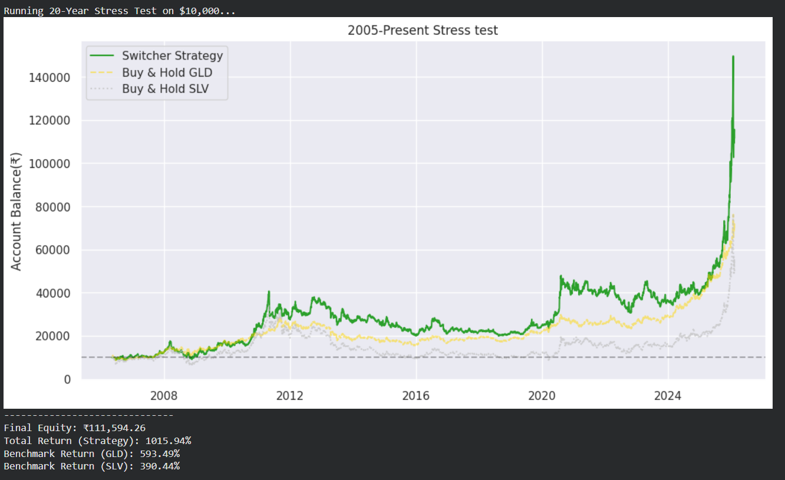

# Adaptive Gold–Silver Rotation Strategy using Kalman Filter

A quantitative trading strategy that dynamically estimates the relationship between **Gold (GLD)** and **Silver (SLV)** using a **Kalman Filter** and allocates capital to the stronger asset over time.

This project began as a statistical arbitrage (pairs trading) experiment and evolved into a **momentum-based asset rotation system** after observing that measuring relative strength was more effective than hedging the spread.

---

## 📊 Strategy Overview

Gold and Silver are historically correlated commodities.  
Instead of assuming a fixed relationship, this project models a **time-varying hedge ratio (β)** using a Kalman Filter.

### Strategy Logic
1. Estimate dynamic beta between Gold and Silver.
2. Smooth beta using moving averages.
3. Detect trend direction of beta.
4. Allocate capital to:
   - **Gold (GLD)** when beta trends upward.
   - **Silver (SLV)** when beta trends downward.
5. Backtest performance from **2005 – Present**.

This creates an adaptive rotation strategy that follows the leading metal.

---

## ⚙️ Methodology

### Data
- Source: Stooq (via `pandas-datareader`)
- Assets:
  - GLD — Gold ETF
  - SLV — Silver ETF
- Period: 2005–Present

### Model
- State-space model implemented via a custom Kalman Filter
- Dynamic hedge ratio estimation
- Process noise and measurement noise control adaptability

### Signal Generation
- 6-day moving average → short-term beta
- 21-day moving average → trend beta

Signal Rules:
- Short MA > Long MA → Long Gold
- Short MA < Long MA → Long Silver

### Backtest Assumptions
- Long-only rotation
- Full capital allocation
- Daily rebalancing
- No transaction costs (baseline test)

---

## 📈 Results

### Equity Curve



---

## 📉 Performance Summary

| Metric | Value |
|---|---|
| Initial Capital | ₹10,000 |
| Final Equity | ₹111,594 |
| Total Return (Strategy) | **1015.94%** |
| Buy & Hold Gold (GLD) | 593.49% |
| Buy & Hold Silver (SLV) | 390.44% |

The adaptive rotation strategy significantly outperformed both individual buy-and-hold benchmarks over the testing period.

---

## 🧠 Key Insight

Traditional pairs trading assumes mean reversion between correlated assets.  
This project demonstrates that:

> Measuring the evolving relationship between assets can be more profitable than attempting to hedge it.

The Kalman Filter acts as a real-time estimator of market leadership between Gold and Silver.

---

## 🛠 Tech Stack

- Python
- Pandas
- NumPy
- Matplotlib
- Seaborn
- pandas-datareader

---

## 🚀 How to Run

Clone repository:

```bash
git clone https://github.com/<your-username>/Quant_Commodity_Rotation.git
cd Quant_Commodity_Rotation
pip install -r requirements.txt
python Strategy.py

